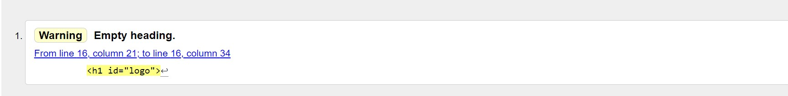

# Step Counts
Step Counts is a four-pages website that advertises the Step-Counts App, an application for mobile devices based on a steps counter who converts every step made into money instantly. This App is conceived to encourage people to increase their daily movement with easy activity such as walking, as they would be financially rewarded by doing that. This website targets every person who is looking for motivation to start doing some exercise as it praises and highlight the several benefits of walking, as also it suits to those who already enjoy this activity as part of their daily routine and who can take advantage from this habit. 

---

# Website Structure
The website is structured in four pages, showed on the navigation bar on top of the website page.

1. ## The main page : Step in
- It contains an introduction of the app, explaining its main purpose and also a brief lecture of the benefits of walking and reasons that aim to encourage the user to dowload the app and start walking.
2. ## Second page: Just few steps
- It explains how the app works, how to dowload it and how to use it.
3. ## Third page: Why it Counts
- It explains 10 of many benefits that a daily walk can apport to the user life.
4. ## Fourth page: Sign-up.
- A Sign up form to get the Step Counts Promo Code, an incentive of 30k steps or the equivalent of 7.5 euros. The user will be able to use this Code after dowloading the app.
- Step code-page: This page is linked to the Sign-up page. It will show up on a blank page once the user will fill out the Sign up form. 

## The website is build up with constant references to the main topics: walking and the Step Counts App. This is reflected not only in terms of contents but also in terms of layout, such as the choice of the different titles for the section, pictures and animations. The purpose of those features is to renforce and promote the activity of walking and  entertain the user inducing positive feelings that will possible lead him/her to the promoted activity and so the usage of the app.
---
## Features
### Navigation bar and Footer
The Navigation bar and the Footer are featured over the fourth pages. It gives consistency to the web site and are easy to navigate and accessible to the user. The colors used are shades of pink and maroon colors. Those color shades are also primarly used for the rest of the website features.

### Navigation bar 

- It includes the Logo of the Website displayed at the top center of the navigation bar and that links to the main page. 

  
  -  It is represented by two foot prints sorrounded by a circle. The circle is removed when desplayed on smaller screens.
   - An hover effect has been applied. When hovered, the two foot prints will change their original dimensions giving the effect of" feet making steps". 
    
- It includes 4  Navigation links to the the four different pages: Step in, Just Few Steps, Why It Counts and Sign up.
     - The four links are distributed along the bar with equal space between them and on smaller screens, they are displayed in column in the center of the navigation bar, just below the logo.
     - Every link it is supported by an icon that renforces the purpose of every link.
         - Foot prints for Step in as "Step into this content"
         - Gears for Just Few Steps as "How it works".
         - Question mark for Why it counts as "Why walking is good for the user".
         - Notes block and pen as for "Sign up as "write the user details".

     - An hover effect has been applied. When hovered, the link involved will change color from maroon shade to pink shade.
     

### Footer

  - It includes an image of foot prints on sand that takes all the width of the page where it is located.
  - It includes social media icons for Facebook, Twitter, Youtube and Instagram where idieally the user can find more details about the Step Counts App on the social platforms.
 - The style choice  applied to the footer resembles the one used for the navitagion bar in terms of colors and animations such as hover effect.
 ---

  
## Step in Features
### Landing page

- The landing page consists of a picture of shoes over the edge of some stairs. It is the background of three inspirational quotes about walking.
Its purpose is let the user step  into the main topic of the website and setting a positive attitude towards the walking activity trough the reading of the quotes.

### Step counts introduction

- This section is a short  introduction of the Step Counts App
- It consist of a main heading and a short paraph which briefly hints at the app and instil curiosity into the user and prepare him/her to the content itself.
   
   *Every page is fitted with an introduction section equal and consitent in style that will anticipate the user to main content and purpose of the page visited.
   #### (Just few steps introduction section)
    
#### (Why it counts introduction section)

#### (Sign up introduction section)

### The hero section

- This section is merely decorative. 
- It divides the introduction of the main topic from the topic itself.
- It consists of one picture of three mannequins and its copy flipped in the opposite direction and positioned  diametrically opposite one from another on two different rows. One top of the other.
- The pictures are targeted with animation that will move the picture on the top from the left to the right, and the picture below from the right to left, giving the illusion of a walk. The animation will be unset on smaller screen and the two pictures will be positioned in the center of the screen.
### Step Counts section 

- In this section the user will get to know the Step Counts app and its purpose as also why walking and so using the app could be beneficial for the user.
- After the lecture of the paragraph the user will find a link that when clicked  will open in a blank page and will bring the user to the "Just Few Steps" page where he/she will be able to know more about the app.
---

## Just few steps Features
### Instructions section

- Displayed after the introduction section, the instructions section explains the user how to download the app and how it works and how to use it.
- It consist of a list of easy steps with additional description for each of those, about how to start using the app. Each action listed, is supported by an image that displays the content of every step to help the user understand better how to use Step-counts-app.
- The images are made using the web site Animatron.
- Every image is targeted whit an animation that will make every picture rotate from the side of the page to the center final position. The pictures and their animations will be unset on smaller screen.
---
## Why it counts Features

### The Gif Section

- This section is mainly decorative. The original picture has been turned into a Gif.
- The column on both side of the section will give the user positive messages and advices before the main content in the section below.
### 10 Good Reasons Section

- In this section the user will read the benefits of walking. 
- Its purpose is to encourage the user with good and valid reasons , prospetting the positive achievable results that the habit of walk can give.
---

## Sign up Features
### Sign up section 

 - In this section the user can choose to sign up in order to get a promo code that will be able to use after dowloading the app.
 - The user will be asked to type his/her name and Email Address. Once the details are entered and the "sign-up" button clicked, the user will be brought to a new blank page that will show the user the Step Counts Promo Code and as well how to use it.
  #### Step Counts Promo Code
  

---
# Testing

- The Project was tested  and worked in different browsers: Firefox, Chrome, Safari.
- I confirm that the Project is resposive, looks good on all standard screen sizes using Devtools device toolbar.
- I confirm that all the features of the Project are understandle, accessible and easy to navigate.
- I confirm that all internal links will open in a blank page.
- I confirm that the form works: requiers entries in every field and the submitt button works.
- I confirm that all the pictures have alt attribute.

## Validator Testing
### HTML 
No errors were returned when passing through the official W3C validator 
#### w3c validator for index.html

#### w3c validator for just-few-steps.html

#### w3c validator for why-it-counts.html

#### w3c validator for sign-up.html

 ### CSS
 No errors were returned when passed trough the official Jigsaw validator.
 
 
 ### Accessibility
 I confirm that all the features are easy to read, navigate and accessible and passed through Lighthouse checks.
 

  

---

## Deployment

The site was deployed to GitHub pages. The steps to deploy are as follows:
- In the GitHub repository, navigate to the Settings tab
From the source section drop-down menu, select the Main Branch
- Once the main branch has been selected, the page will be automatically refreshed with a detailed ribbon display to indicate the successful deployment.
- The live link can be found here - https://villelligiulia.github.io/Steps-in.station/

---
## Credits
### Content
- Part of written contents such as sentences, benefits of walking, general informations about walking were inspired, copied or taken from  

https://wearewellbeing.co.uk/insights/10-reasons-why-walking-is-good-for-you/ 

 

https://www.healthline.com/health/benefits-of-walking#burn-calories

- Quotes on landing page of index.html: 
  - Friedrich Nietzsche, Twilight of the Idols
  -  Chinese Proverb
  - Elizabeth von Arnim, The Adventures of Elizabeth in Rügen 

- Social media code for footer was taken from the CI Love Running Project

## Media
All the media contents where taken from Pexels with the exeption of :
- walkcycle.jpg , walkcycle.jpg  from Pinterest.

 

